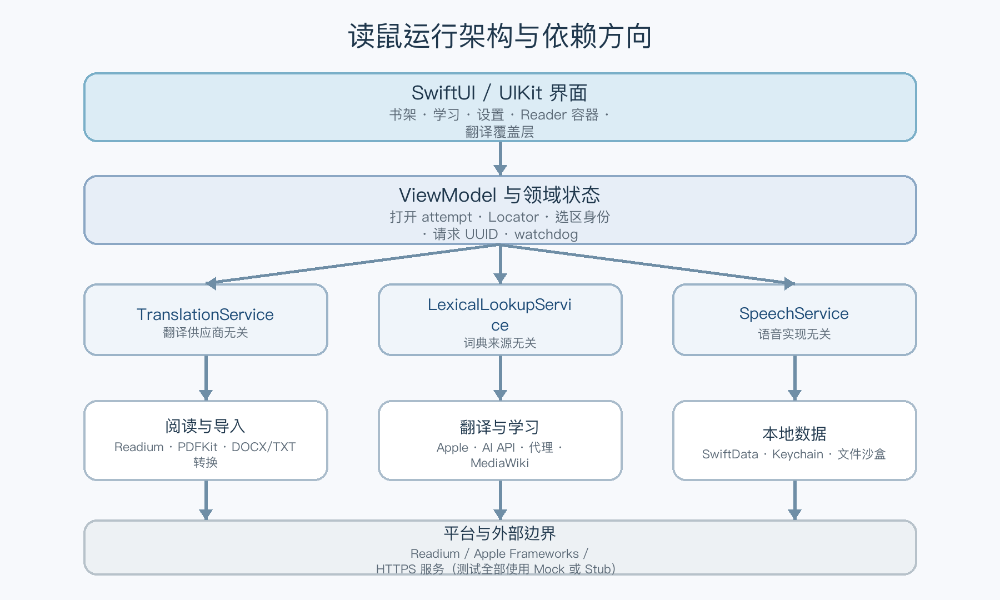
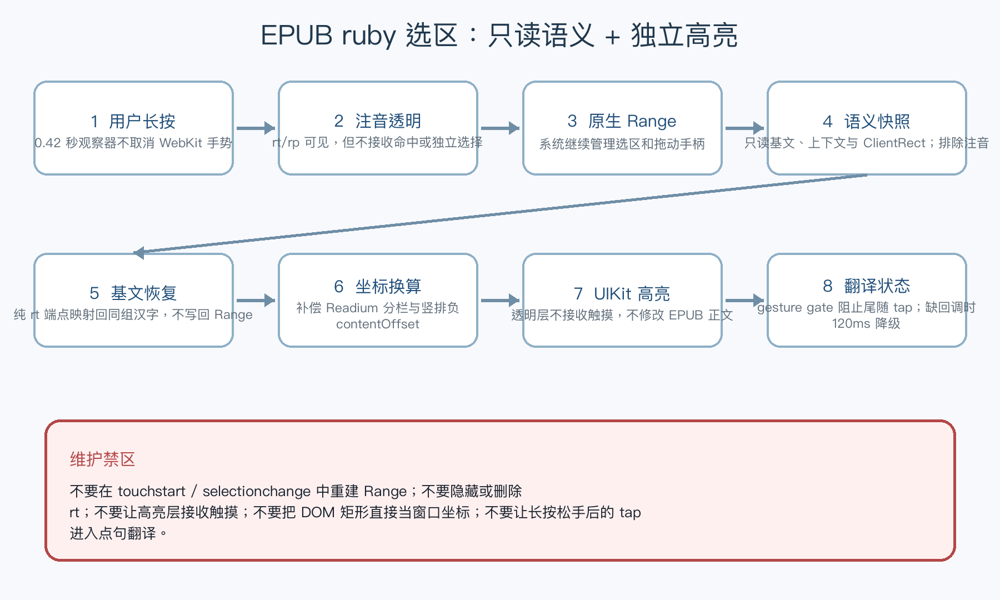

# Jerreader（Jerreader）开发与维护交接指南

> 适用版本：1.3.5（内部 build 56）
> 更新日期：2026-08-03
> 平台基线：iPhone + iPad / iOS 18+ / Swift 6  
> 文档对象：后续接手开发、排查问题、打包发布的工程师

这份文档不是逐行代码说明，而是帮助新维护者快速建立正确的“心智模型”：哪些模块负责什么、数据怎样流动、哪些实现不能随便替换、出现问题先看哪里，以及怎样验证修改没有破坏阅读和翻译主流程。

---

## 0. 十分钟速览

### 0.1 这个 App 做什么

Jerreader是一款以中、英、日三语阅读与学习为核心的 iOS 电子书应用。当前支持：

- EPUB、PDF、DOCX、TXT 导入；
- EPUB/PDF 阅读、逐页翻页、目录、全文搜索、书签和阅读位置恢复；
- 划线、批注、笔记及标记跳转；
- 日文原版排版与横排模式切换；
- 可切换句子/段落的轻点翻译、长按智能选词/选句、拖动手柄精确选择；
- Apple 翻译、GPT、Claude、Kimi、DeepSeek、Gemini、OpenAI 兼容服务及自建代理；
- “学习 → 翻译”中的中英日词语/句子工作台，可在页面内独立选择 Apple、AI API 或 AI 代理；词语模式合并词典详情，日文句子译文使用本机分词生成假名注音；
- 翻译缓存、自动重试、备用服务、AI 句子结构分析、跨页句段扩展和译文收藏；
- 阅读内把完整中、英、日文词语加入生词本，以及可关闭的翻译完成触感反馈；
- 词典详情、生词本、查词历史与 CSV/Markdown/Anki TSV 导出（语音功能当前暂时隐藏）；
- PDF 文字层点击翻译和 Vision OCR；
- 可选范围的手动/自动备份、保留时间、份数和容量管理，以及校验后增量恢复；
- iPad、横屏、自适应主导航及 Readium 自动单双页展开。

### 0.2 四条不能破坏的原则

1. **Readium 负责 EPUB/PDF 解析和排版。** 不自行重写分页引擎。
2. **翻译、解释和高亮只能临时覆盖。** 不把译文写入 EPUB，不永久修改正文 DOM。
3. **UI 依赖领域协议。** UI 不直接解析第三方翻译或词典响应。
4. **外部文件只读。** 导入时生成 App 沙盒副本，不原地打开或回写用户文件。

### 0.3 接手后优先阅读

按以下顺序阅读：

1. `AGENTS.md`：开发硬规则；
2. `Jerreader_PRD_v1.0.md`：产品目标与验收原则；
3. `docs/ARCHITECTURE.md`：当前技术决策；
4. 本文档：维护路径与操作手册；
5. `README.md`：当前功能、使用方法和最近验证结果。

### 0.4 当前最重要的技术风险

- **页面内覆盖层绝不能用 `window.scrollX/scrollY` 定位。** 点句翻译的高亮是在页面里自绘的 `<div>` 覆盖层，标记曾用 `rect.left + window.scrollX` 定位。这两个值只在普通的 `horizontal-tb` + `ltr` 文档里等于「包含块到视口」的偏移；在 `vertical-rl`（也就是每一本按原版排版阅读的日文书）里并不成立，于是**所有标记都被放到屏幕外**——表现为「竖排书点按有译文但完全没有高亮，而长按有高亮」（长按走的是 UIKit 的 `EPUBSelectionBridge`，不受影响）。正确做法：先把覆盖层插入 DOM，再用 `overlay.getBoundingClientRect()` **实测**它自己原点的位置，标记按 `rect.left - origin.left` 定位。这与书写方向、文字方向、分栏分页全都无关。诊断口诀：**长按有、点按无 → 看页面内覆盖层；两者都无 → 看选区或脚本注入。**
- **选区高亮的坐标换算不能只赌一种映射。** `EPUBSelectionBridge.display()` 把 DOM 矩形换算到高亮层坐标后，会丢弃不与可见区域相交的矩形。过去只用一种映射（bounds 原点 + 负 contentOffset.y 补偿），竖排书下该假设不成立，于是**所有**矩形被丢弃、`clear()` 被调用、高亮整体消失——而翻译卡片仍用 Readium 的备用 frame 正常显示，所以表现为「文字选对了、译文也对，就是没有高亮」。现在改为 `viewportOffsets(for:)` 依次尝试若干候选映射，取第一个能落在视图内的（用户刚做出的选区按定义就在屏幕上，这是可靠的判据）。诊断这类问题时，先看是否「有译文无高亮」——那就是这一层，不是选区层。
- **绝对不要在 `setupUserScripts` 拿到的 `WKUserContentController` 上删除脚本。** 那是 Readium 自己的 controller，`readium-reflowable`（原生选区回调、decoration 高亮、手势）就注册在上面。3.0 曾因为在切换版式时调用 `removeAllUserScripts()` 连带清空了它，导致选区高亮整体失效。只允许 `addUserScript`；需要让已加载文档改变行为时，用 `evaluateJavaScript` 或 §4.2.1 的 localStorage 通道。有静态测试 `testReaderNeverRemovesScriptsFromReadiumsContentController` 守护。
- **日文 ruby 注音选区**已经经过整体重构。不要再使用 JavaScript 主动重建 WebKit Range，也不要给 `touchstart` 或 `selectionchange` 增加选区改写逻辑。
- **导入必须使用 `asCopy: true` 的文档选择器**（`CopyingDocumentPicker`）。SwiftUI 的 `.fileImporter` 交回的是原文件的就地安全作用域 URL，只要访问它，iCloud/文件提供方就会实体化并刷新原文件的修改时间——这与之后是否复制无关。
- **书架副本打开也必须保持只读。** `EPUBPublicationService` 在交给 Readium 前移除出版物副本的 POSIX 写位，并在打开结束后恢复先前修改日期；不要以“文件已在 App 沙盒”为由删除这层保护。
- **书籍打开链路**依赖 attempt ID、自动重试和 25 秒 watchdog。不要把 Readium 对象放入 detached task，也不要让过期打开结果回写当前页面。
- **不要在 `@Published` 的 `didSet` 中无保护地回写同一属性。** 3.4 的备份策略校正曾因此在异常设置值下递归到栈溢出；`LibraryBackupPolicyStore` 现在用统一重入门校正数值与空范围。
- **翻译请求**依赖请求 UUID、缓存身份和重试身份。不要仅用“原文字符串”判断请求是否相同。
- **Git 交接状态（2026-07-23）**：仓库已初始化在 `main`，但还没有首次提交，文件仍处于未跟踪状态。正式交接前应先完成密钥/证书扫描，再建立一个可回退的基线提交。

### 0.5 当前已知边界

- 阅读正文“短按完整单词并直接写入学习记录”仍是 Readium 下的未完成正式目标；当前稳定入口是阅读中长按翻译并加入生词本，或使用“学习 → 翻译 → 词语”获取译文和词典详情。
- Apple Translation 的真实语言包只能在支持的 iOS 18+ 真机上最终验收；模拟器自动化使用 Mock，不伪造真机结果。
- 不支持 DRM 绕过、旧 `.doc`、MOBI/AZW/AZW3、整本自动翻译、登录、支付或云同步。
- 最低系统为 iOS 18.0；Apple Translation 的真实语言包仍需真机验收。

---

## 1. 产品与开发思路

### 1.1 原文阅读优先

核心体验是“先阅读，辅助信息按需出现”。翻译卡片、词卡和高亮都应短暂出现，关闭后不影响正文结构、阅读位置或分页结果。任何为了翻译而插入双语段落、替换出版物文字或永久写入样式的方案，都不符合产品方向。

### 1.2 平台能力优先

- EPUB/PDF：Readium Swift Toolkit；
- PDF 文字与坐标：PDFKit；
- 扫描页识别：Vision；
- 系统翻译：Translation Framework；
- 语言识别与分词：NaturalLanguage；
- 语音底层：AVSpeechSynthesizer（2.6 由功能开关统一关闭，不向 UI 暴露）；
- 本地持久化：SwiftData；
- 密钥：Keychain。

平台能力不足时可以增加适配层，但不要绕过 Readium 重写电子书排版。

### 1.3 协议隔离外部服务

`TranslationService`、`LexicalLookupService` 和 `SpeechService` 是稳定边界。界面和阅读器只传入领域数据，具体供应商协议、请求头和响应 JSON 全部留在 `Data/Services`。

这样做有三个好处：

- 替换供应商时不用修改阅读 UI；
- 自动化测试可以使用 Mock/Stub，不依赖外网；
- 缓存、错误映射和重试策略可以保持一致。

### 1.4 异步状态必须可取消、可判旧

用户可能连续点句、翻页、关闭阅读器或切换服务。所有耗时链路都要回答三个问题：

1. 当前操作是否仍属于最新请求？
2. 页面关闭后结果应该写到哪里？
3. 超时或取消后是否允许自动重试？

当前实现使用 attempt ID、请求 UUID、Task 取消、watchdog 和语义身份解决这些问题。新增异步功能应沿用同样思路。

---

## 2. 技术基线

| 项目 | 当前选择 | 维护说明 |
| --- | --- | --- |
| App 版本 | 1.0.3（内部 build 44） | App 关于页只展示 Marketing Version；发布时仍需递增内部 Build Number |
| 最低系统 | iOS 18.0 | Apple Translation 和现有工程设置均以此为基线 |
| Swift | Swift 6 | 注意 MainActor、Sendable 和结构化并发检查 |
| UI | SwiftUI + UIKit 桥接 | SwiftUI 管理页面；Readium Navigator 由 UIKit 容器承载 |
| 数据库 | SwiftData | 模型集中注册在 `JerreaderApp` |
| 阅读引擎 | Readium 提交 `3d8bcdc` | 3.8.0 后续缓存失效修复；`ReadiumShared/Streamer/Navigator/AdapterGCDWebServer` |
| ZIP | ZIPFoundation 3.0.1 | 用于文档转换与 EPUB 包处理 |
| 翻译 | Apple / 直接 AI API / HTTPS 代理 | 全部实现 `TranslationService` |
| 词语模式词典详情 | 中文维基词典 MediaWiki + 系统词典后备 | 自动化测试使用本地 Stub/Mock |
| 测试基线 | iPhone 16 Pro + iPad Pro 11 英寸 / iOS 18.2 模拟器 | 维护者可替换为本机已有的 iOS 18+ 设备 |

供应商的 endpoint、模型名和 API 版本会变化。修改默认值前应查看供应商官方文档，并同步更新请求构造测试；不要只改设置界面上的文字。

---

## 3. 工程结构与依赖方向



### 3.1 目录职责

| 目录 | 主要职责 | 修改时的边界 |
| --- | --- | --- |
| `Jerreader/App` | App 入口、三标签导航、设置、指南、主题 | 不在这里解析 EPUB 或第三方响应 |
| `Jerreader/Core/Models` | 领域模型、SwiftData 模型、枚举和错误 | 模型变化要考虑旧数据库默认值 |
| `Jerreader/Core/Services` | 翻译、查词、语音协议 | 协议应保持供应商无关 |
| `Jerreader/Data/Services` | Readium 打开/导入、转换、网络实现、缓存、Keychain、导出 | 网络必须可注入；测试不能依赖外网 |
| `Jerreader/Features/Library` | 书架、导入、分类、标签、打开与删除 | 外部 URL 只交给导入服务，不长期保存 |
| `Jerreader/Features/Learning` | 查词、生词本、历史、收藏、导出 | 只使用领域模型和服务 |
| `Jerreader/Features/Reader` | EPUB/PDF 阅读、分页、选区、OCR、翻译覆盖层、阅读设置 | 这里是交互最复杂、回归风险最高的区域 |
| `Jerreader/Resources` | Info.plist、图标、颜色和本地化 | 不放密钥、证书或真实测试书 |
| `JerreaderTests` | 单元与集成测试 | 默认完全离线 |
| `JerreaderUITests` | 真实物理手势 UI 测试 | ruby 测试需要显式注入测试 EPUB |
| `docs` | 架构、维护和决策文档 | 技术决策变化时同步更新 |
| `dist` | 未签名 IPA 等交付物 | 发布前检查不含测试书、密钥和描述文件 |

### 3.2 依赖方向

推荐方向：

```text
SwiftUI / UIKit 界面
        ↓
ViewModel / 领域状态
        ↓
Core 服务协议与领域模型
        ↓
Data/Services 平台或网络实现
        ↓
Readium / Apple Framework / HTTPS
```

禁止的反向依赖：

- Core 模型引用具体网络响应；
- UI 直接拼装供应商 JSON；
- Data 服务持有 SwiftUI View；
- 词典或翻译实现直接修改 Reader 正文。

---

## 4. 关键运行流程

### 4.1 文件导入与打开

#### 导入流程

```text
系统文件选择器 / AirDrop / “用Jerreader打开”
        ↓
LibraryView 统一接收 URL
        ↓
NSFileCoordinator 只读协调 + 临时快照
        ↓
SHA-256 指纹与重复文件判断
        ↓
格式分流
  ├─ EPUB：Readium 校验并复制
  ├─ PDF：Readium/PDFKit 校验并复制
  ├─ DOCX：提取 Open XML → 生成本机 EPUB
  └─ TXT：检测编码 → 生成本机 EPUB
        ↓
写入 Application Support 私有目录
        ↓
保存 BookRecord，进入阅读器
```

关键文件：

- `Features/Library/LibraryView.swift`
- `Data/Services/EPUBImportService.swift`
- `Data/Services/DocumentConversionService.swift`
- `Core/Models/BookFormat.swift`
- `Resources/Info.plist`

#### 为什么用户原文件不应改变修改时间

`Info.plist` 明确设置 `LSSupportsOpeningDocumentsInPlace = false`。对于仍由外部打开入口传入的安全作用域 URL，导入服务使用 `NSFileCoordinator` 进行只读协调并复制临时快照，后续解析只读取快照。维护时不要把外部 URL 直接交给 Readium 长期持有，也不要对原 URL 调用写入、属性更新或解压操作。

#### 打开流程

```text
点击书架封面
  → 创建新的 LibraryReaderSession
  → EPUBReaderViewModel.load()
  → EPUBPublicationService.open()
  → 创建 Publication 与 Navigator
  → 恢复 Readium Locator
  → 展示正文
```

每次打开都有独立 attempt ID 和 25 秒 watchdog：

- 第一次 SwiftUI 生命周期瞬时取消，可自动重试一次；
- 用户主动退出、watchdog 超时或第二次取消，不应继续自动重开；
- 迟到的旧 Publication 必须关闭，不能覆盖新 attempt。

如果书籍卡在加载页，先检查 attempt ID、Task 取消来源和 watchdog，不要简单延长 loading 时间。

### 4.2 EPUB 分页、方向与阅读位置

- Readium 使用禁止滚动、适配页面、自动列数和自动 spread 的逐屏模式；iPhone 通常单页，iPad/横屏可自动双页。
- 重排版 EPUB 保留 Readium 的横向 pan，因为它同时参与逐页手势和原生文字选择。
- 原版日文模式尊重出版物 `verticalText` 和 `readingProgression`；日文竖排书因此从右向左翻页。
- 横排日文模式同时设置 `verticalText = false` 与 `readingProgression = .ltr`，章节内外都从左向右。
- **仅靠 Readium 偏好设置无法把竖排书变成横排**，必须配合写作方向策略脚本，详见 §4.2.1。
- 位置保存使用完整 Readium Locator JSON，而不是只保存百分比。
- 位置变化节流写入；离开阅读器或进入后台时立即刷新。
- 字体、字号、行距、段距、页边距、背景和日文方向按书籍保存在 `BookRecord`。

#### 4.2.1 竖排 ↔ 横排一键切换：写作方向策略（v1，2026-07-28 起）

**为什么必须自己实现。** Readium 通过在 `cjk-vertical` 与 `cjk-horizontal` 两套 Readium CSS 变体之间切换来表达 `verticalText`。但这两套变体并不对称：

| 变体 | 是否声明 `writing-mode` |
| --- | --- |
| `cjk-vertical/ReadiumCSS-after.css` | 是，`:root { writing-mode: vertical-rl }` |
| `cjk-horizontal/*`（全部文件） | **完全没有任何 `writing-mode` 声明** |

也就是说，切到横排只是「不再强制竖排」，**从不强制横排**。对于自带竖排声明的日文书（EBPAJ 常见写法：`<html class="vrtl">` + `.vrtl { -webkit-writing-mode: vertical-rl; -epub-writing-mode: vertical-rl }`），出版物自己的 CSS 依然生效，无论提交多少次偏好、重载多少次资源都还是竖排。这就是历史上「横排切不过去」的根因，不是缓存问题，也不是时序问题。

**真实日文书的形态规律。** 抽样五本市面上的日文竖排书，竖排声明的位置各不相同，这决定了方案必须是通用的而不是针对某一种写法：

| 书 | 竖排声明位置 | 选择器类型 | `!important` |
| --- | --- | --- | --- |
| Just Because | 无（正文没有任何 writing-mode，全靠 Readium） | — | — |
| 青春ブタ野郎（EBPAJ 模板） | `<html class="vrtl">` | 类选择器 `.vrtl` | 否 |
| ナミヤ雑貨店の奇蹟 | `<html class="vrtl">` | 类选择器 `.vrtl` | 否 |
| 白夜行（Kindle 转出） | 内层 `div.kindle_inner`（且只在扉页） | 类选择器 | 否 |
| 容疑者Xの献身 | 独立 `vertical_text.css` | **`html` 元素选择器** | 否 |

共同点：全部是 `page-progression-direction="rtl"` + `dc:language=ja`，所以 Readium 一律判定 `verticalText = true`。差异点：声明可能落在根元素的类、根元素本身、任意内层容器，或者干脆不存在。抽样中没有一本使用 `!important`，但方案不能依赖这一点——一旦有书使用，仅靠样式表规则就会输掉优先级。

因此通用方案必须同时满足三条：**与选择器无关**（不能只针对 `.vrtl`）、**与层级无关**（根元素和内层容器都要覆盖）、**与优先级无关**（连出版物的 `!important` 也要压过）。

**当前方案。** `EPUBReaderViewController.writingModePolicyScript(forcesHorizontal:)` 在 document-start 注入，补上 Readium 缺失的那条声明：

1. 注入 `<style id="jerreader-reader-writing-mode-policy">`，横排时对 `:root, body` 与 `*` 声明 `writing-mode: horizontal-tb !important`，并同时输出 `-webkit-` / `-epub-` / `-ms-` 别名（日文书仍在用只带前缀的写法）。
2. 在 `documentElement` 和 `body` 上写**行内** `!important` 声明。行内声明在层叠中高于任何作者样式表规则，因此连出版物自己的 `!important` 也会被压过——这一步让切换从「优先级赛跑」变成确定性结果。
3. 对 `[class]` / `[style]` 元素做上限 4000 个的有界扫描，把计算后仍是竖排的内层容器也钉成横排；被钉过的元素带 `data-jerreader-writing-mode` 标记，切回原版时按标记精确还原。
4. `publication`（原版）模式下脚本内容为空且清除所有标记，完全把版式交还给出版物和 Readium。
5. 幂等：同一文档重复执行会在开头直接返回。

**宿主侧联动**（同文件）：

- `setupUserScripts` 同时注册选区策略与写作方向策略；`userContentControllers` 弱引用保存控制器。
- 切换版式时先 `refreshUserScripts()` 重新注册（把新模式烘焙进脚本源），再 `submitPreferences`，这样 Readium 重载后的新文档在 document-start 就是正确方向，不会闪一下旧版式。
- `enforceWritingModePolicy()` 对已加载文档立即生效；用 `writingModePolicyModes` 这张 WebView→模式表去重，避免每次布局都发一次 WebKit 往返。
- 翻页方向由 `preferences()` 决定：横排 `.ltr`，原版竖排 `.rtl`。Readium 的 `goLeft/goRight` 按 `readingProgression` 映射，所以边缘点按与滑动会自动跟着反向。

**收敛检测改用样式变体，而不是计算后的 writing-mode。** 因为策略脚本会把计算值钉死，它永远等于期望值，已不能用来判断 Readium 自身是否真的换了版式。`currentDocumentServesVerticalCSS()` 改为读取注入的 `link[rel=stylesheet]` 里是否含 `/cjk-vertical/`——这才是「Readium 是否给了匹配的分页模块」的诚实信号。竖排与横排的分页模块不同，若变体没换而只有文字方向变了，排版会错乱。

**验证情况（2026-07-28）。** 除合成夹具外，四本真实日文书跑通了「原版竖排 → 一键横排 → 切回原版」全链路，每一步都校验计算后的 `writing-mode` 与 `readingProgression`：白夜行、ナミヤ雑貨店の奇蹟、容疑者Xの献身、青春ブタ野郎。合成夹具那条用例做过阴性对照——临时停用策略脚本后它会失败在 `vertical-rl`，证明这条断言确实锁住了本次修复而不是碰巧通过。

维护者可以用同样方式验证任何可疑的书（不需要把书放进工程）：

```sh
TEST_RUNNER_JERREADER_LAYOUT_EPUB_PATH="/path/to/book.epub" \
xcodebuild test -project Jerreader.xcodeproj -scheme Jerreader \
  -destination 'platform=iOS Simulator,name=iPhone 16 Pro' \
  -only-testing:JerreaderTests/LibraryTests/testExternalEPUBSwitchesBetweenVerticalAndHorizontal \
  CODE_SIGNING_ALLOWED=NO CODE_SIGNING_REQUIRED=NO
```

注意必须带 `TEST_RUNNER_` 前缀：模拟器测试进程不继承终端环境变量，xcodebuild 只转发这个前缀的变量并在传入时去掉前缀。另外 iBooks 书库里的 `.epub` 往往是**解包目录**而不是 zip，导入会报 `inaccessibleFile`，需要先重新打包（`mimetype` 必须是第一个且不压缩）。

**红线：**

- 不要以为只调 `EPUBPreferences.verticalText` 就能切横排，它对自带竖排 CSS 的书无效；
- 不要把策略收窄成只匹配 `.vrtl` 之类的具体选择器——真实书的写法五花八门；
- 不要删除策略脚本里的 `-epub-` / `-webkit-` 别名；
- 不要把行内 `!important` 那一步换成只写样式表规则，出版物的 `!important` 会赢；
- 不要把收敛检测改回比较计算后的 `writing-mode`；
- 不要在 `publication` 模式下残留任何声明或标记；
- 判断版式是否切换成功时，必须等 `document.readyState === 'complete'` 并二次确认——样式表加载完成前，竖排书的计算值也是 `horizontal-tb`，早读会得到假阳性。

### 4.2.2 目录、章节定位与进度条（3.0 起）

**目录自动导入。** `ReaderOutlineBuilder.build(tableOfContents:readingOrder:)` 决定目录内容：

- 出版物自带目录且条目多于一条 → 直接使用，保留层级；
- 目录为空、或只有一条（常见的「只列封面的 NCX」，导航价值为零）→ 从 `readingOrder` 的 HTML 文档生成；
- 生成时保留出版物自带的 `title`；文件名是 `part0007_split_002` 这类无意义编号时，改用「第 N 节」；
- 整本只有一个正文文档 → 保持为空，界面显示「没有目录」。

生成的条目带 `isGenerated` 标记，便于将来区分显示。

**当前章节定位。** `ReaderOutlineItem.resourceKey` 把 href 归一化（去掉 `#片段`、`?查询`、前导 `/`，并解码百分号转义），因为目录常指向 `chapter.xhtml#sec2` 而阅读位置报告的是裸资源名。`currentOutlineItem` 先按资源匹配，同一资源有多个条目时再用进度选最后一个已越过的条目。打开目录时自动滚动并高亮该条目。

**章节进度。** `resolveOutlineProgressions()` 在书本上屏后异步调用 `publication.positionsByReadingOrder()`，取每个资源第一个位置的 `totalProgression` 作为该章起点，写回 `outline`。它**不能**放在打开流程的关键路径上——那会拖慢首屏。找不到对应资源的条目继承上一个已知起点，避免进度条上章节倒退。

**底部进度条。** 拖动时只做本地预览：用 `outlineItem(atProgression:)` 解析拖到哪一章并显示章节名，松手才真正 `seek`。拖动过程中不导航，否则每一帧都会触发 Readium 跳转。左右各一个「上一章/下一章」按钮；「上一章」在当前不在章首时先回到本章开头，符合常规阅读器行为。

### 4.2.3 目录标题的修复与显示（3.1 起）

真实电子书的导航文档经常不可用：`容疑者Xの献身` 的 NCX 里有一条标题就是 `１`，nav.xhtml 又把整本正文塞进一个「本文」条目（全书 600KB 在单个 xhtml 里，没有任何标题标记）。因此有两层处理：

1. **`ReaderChapterTitle.isMeaningful`**：纯数字（含全角）、单字、`本文`/`目次`/`表紙` 这类通用词、与书名相同的标题一律判为无意义。顶栏和进度条用 `ReaderChapterTitle.display` 依次尝试「目录标题 → locator 标题 → 书名」。
2. **`ReaderOutlineBuilder`** 判断目录是否可用时看的是**覆盖了几个正文文档**，不是条目数量：只指向一两个文档的目录（封面/目次/扉/本文）导航价值为零，改从 `readingOrder` 生成。
3. **`repairMeaninglessOutlineTitles()`** 在上屏后异步读取那些无意义条目自己的文档，按 `h1–h6` → 日文常见的 `midashi`/`chapter`/`caption` 类 → `<title>` 的顺序提取真实标题回填。只读需要修复的条目，目录本来就好的书零开销。

### 4.2.4 备份与恢复（3.4）

侧载安装重新签名或更换 Bundle ID 时，iOS 可能创建新的应用容器。`LibraryBackupService` 的 v2 归档是自包含的 `.jerreader-backup` 文件：`manifest.json` + `records.json` + 可选的 `defaults.json`、`Books/` 和 `Covers/`。

- **范围可选**：`LibraryBackupScope` 分为书籍与封面、阅读进度/书签/批注、生词/查词历史/翻译收藏、非敏感设置四组。学习或阅读范围会保留书籍引用元数据，但只有“书籍与封面”包含实际出版物文件。
- **备份目录由用户明确选择**：备份中心可授权 iCloud Drive、“我的 iPhone”或其他文件提供商文件夹，自动备份和手动保存都写入当前目录。授权书签只属于当前安装，不进入备份；重装后需重新选择同一目录。若仍使用默认 App Documents，卸载时备份会一起删除。
- **恢复有两条路径**：当前目录中已列出的备份使用行内可见的“恢复”按钮，不需要再进文件选择器；手动“从备份文件恢复”会以已授权目录为起点。每次点击必须创建新的 picker identity，并在 picker 完全 dismiss 后再弹恢复确认，避免第二次及后续选择与旧会话或确认弹窗竞争。iCloud/File Provider 在文件完成本地物化前可能把 `.jerreader-backup` 报成普通归档、数据，甚至仅符合 `public.item` 的动态 UTI，因此 picker 接受自定义 UTI + `public.archive` + `public.data` + `public.item`；放宽 picker 不等于放宽恢复，实际导入仍必须通过 manifest、路径、大小和摘要校验。
- **自动执行是到期补做，不是系统闹钟**：`LibraryBackupAutomation` 在 App 启动、回到前台和进入后台时检查到期状态。iOS 不保证 App 完全未运行时准点唤醒。
- **保留策略**：可配置间隔、保留天数、最多份数和总容量。清理从最旧文件开始，至少保留最新一份；若最新一份本身超过容量上限，会明确报告仍超限。
- **先验证再写入**：v2 为书籍和封面记录 SHA-256 与字节数，恢复还限制元数据、出版物和封面的解压大小，只提取清单明确引用的安全叶文件名。缺少必需书籍、摘要不一致、损坏或版本过新的归档会在创建 SwiftData 记录前被拒绝。
- **恢复是增量且会重映射关系**：书籍按 `fileFingerprint` 匹配；当目标设备中的同一本书 UUID 不同时，书签、批注、收藏和生词来源会改用目标 UUID，并重算依赖 UUID 的唯一键。相同记录重复恢复不产生副本，较旧阅读位置不覆盖较新的本机进度。
- **存 JSON 而不是复制 SwiftData store**：归档记录与数据库 schema 解耦，v1 归档仍可读取；后续格式变更必须提升 manifest 版本并保留兼容解码。
- **API Key 和代理凭据不进备份**：这些值只在 Keychain；重装后需重新填写。翻译缓存也不备份，因为可再生且可能很大。

### 4.3 EPUB 三层翻译交互

1. **轻点模式**：短按正文，按设置命中当前句子或当前语义块内的一个段落后直接翻译。
2. **智能选择**：首次长按原生选区，根据前后文补全单词或句子。
3. **精确选择**：用户继续拖动系统选区手柄后，严格翻译最终框选文字。

轻点模式默认开启“轻点翻译时禁用点按翻页”。横向滑动翻页始终保留；关闭保护或关闭轻点模式后，左右边缘点按翻页恢复。段落选择只读当前 DOM 语义块，PDF/OCR 则用空行、缩进和几何间距限定一段；翻译覆盖层必须避让完整选区联合矩形，而不是只避让点击点。

长段落或较长译文不再用内容高度无界生长：`ReaderTranslationViewportPolicy` 只提高最大可用高度，iPhone 上为 260–300pt，iPad 上限 360pt；卡片本身仍按译文实测高度收紧，只有译文触及上限后才启用卡内滚动。点段模式的额外空间必须放在卡片与完整选区之间，禁止通过强制填满卡片高度制造内部空白。竖排时使用原文左边或右边的普通圆角浮窗，而不是贴边的左右侧栏；手机优选 220pt 宽，必要时可收窄至 144pt，并与点按的原文字列保留 12pt 间隔。日文 EPUB 的竖排元数据缺失时，高窄的实时几何是受限的后备判据。`focusFrame` 只为浮窗避让提供几何锚点，禁止用它改动句/段边界、日文引号规则、Readium Range 或高亮。

### 4.3.1 独立翻译工作台

“学习 → 翻译”不是阅读器设置的快捷入口，而是拥有页面本地状态的翻译工作台。原文可自动识别或手动选择中文、英语、日语，目标语言可在三者间选择；词语模式限制 80 字符并要求 AI 只返回简短译词，句子模式限制 2,000 字符并沿用用户的翻译提示词。页面内切换 Apple、AI API 或 AI 代理不得写回 `TranslationSettingsStore` 的全局 provider/direction，避免下一次阅读时服务或语言方向被意外改变。

Apple 翻译由该页面自己的 `TranslationSession.Configuration` 驱动，AI 路径继续通过现有 `TranslationService` 实现。所有请求在启动前统一解析自动语言、拒绝同语言方向并分配 UUID；方向、模式变化或页面退出时取消旧请求，迟到结果不得覆盖当前界面。自动化测试只用 Mock/Stub；Apple 语言包下载和用户真实 API 账户仍在真机验收。

### 4.4 日文 ruby 注音选区：当前正确实现



这一部分曾多次出现“只选中注音”“汉字和注音都不高亮”“长按后被点句覆盖”和“竖排高亮偏移”等问题，现已整体重构。

#### 正确链路（选区策略 v3，2026-07 起）

生效边界：脚本只存在于 EPUB 阅读器（`EPUBReaderViewController`），PDF 链路不受影响；注音摘除仅在日文内容生效（书籍元数据语言 `ja`/`jpn`，或章节 `lang`/`xml:lang` 为 `ja`，或 `rt` 注音含假名，满足其一），其余 EPUB 只应用不摘除文本的基础 CSS。

1. `setupUserScripts` 在每个 Readium 内容 WebView 的 document-start 注入选区策略脚本：
   - CSS：`rt/rp` 设 `user-select: none` 和 `pointer-events: none`；
   - **DOMContentLoaded 时把每个 `rt` 的注音文本移入 `data-jerreader-rt` 属性并清空其子节点，改用 `rt[data-jerreader-rt]::before { content: attr(data-jerreader-rt) }` 渲染**（`rp` 同理移入 `data-jerreader-rp`，不渲染）；
   - 注音视觉与排版完全不变（横排、竖排均如此），但 DOM 文本流中不再存在注音文本节点；
   - 一个 `MutationObserver` 兜底处理加载后动态出现的 `rt/rp`；脚本可重复执行（幂等）。
2. 因此 WebKit 的原生 Range、长按选词、复制与原生蓝色高亮从物理上只能落在汉字基文上；按在注音上时选区自动吸附到最近的汉字。这一步是根治，下面各层只是安全网和几何换算。
3. WebKit 的原生 Range 和选择手柄始终由系统管理。
4. `EPUBSelectionSnapshot` 只读当前选区：
   - 统一排除 `rt/rp`；
   - 历史上"端点落在 `rt`"的映射逻辑保留为安全网（v3 下不会再触发）；
   - 不把修正后的 Range 写回浏览器。
5. 高亮几何 = 基文文本矩形 ∪ 对应 `rt` 注音矩形（`jerreaderReaderSelectionRects`）：翻译文本永远只有汉字，但可见高亮覆盖整个 ruby 单元，不会在注音下"缺一块"。
6. **点句高亮不使用 CSS Custom Highlight**（WebKit 对 `<ruby>` 内文字不绘制该高亮，表现为带注音的汉字"没被选中"）；改为页面内自绘矩形覆盖层，透明度放在容器上避免基文与注音矩形重叠处叠色。
7. `EPUBSelectionBridge` 把这些 `ClientRect` 转换到 UIKit 坐标。
8. `EPUBSelectionHighlightView` 以不接收触摸的透明层绘制独立高亮（先剔除被包含矩形再按行合并）。
9. `EPUBSelectionGestureGate` 在长按后抑制 1.5 秒内的尾随 tap，避免点句逻辑覆盖选区。
10. 非阻断 `UILongPressGestureRecognizer` 的最短时间为 0.42 秒。Readium 没有及时回调时，等待 120ms 后只读按点处 ruby 基文作为降级。
11. 竖排模式只补偿 Readium 以负 `UIScrollView.contentOffset.y` 表示的 UIKit 安全区位移，避免横排重复计算。

#### 绝对不要这样改

- 不要监听 `touchstart` 后主动创建选区；
- 不要在 `selectionchange` 中 `removeAllRanges()` 或 `addRange()`；
- 不要用 CSS Custom Highlight（`::highlight()`/`CSS.highlights`）绘制阅读器高亮——WebKit 在 ruby 文字上不绘制它；
- 不要隐藏 `rt` 的盒子或删除 `rt` 元素本身（v3 只移走其中的文本节点，元素和视觉必须保留）；
- 不要改动 `data-jerreader-rt` 的写入时机去"提前"处理仍在解析中的文档；
- 不要让 UIKit 高亮层接收触摸；
- 不要把 DOM `ClientRect` 直接当作窗口坐标；
- 不要在长按结束时立即进入点句翻译；
- 不要查询仍挂载但不在可见视口内的相邻 spine WebView。

#### 相关文件与测试

- `Features/Reader/EPUBReaderHost.swift`
- `Features/Reader/EPUBSelectionBridge.swift`
- `Features/Reader/ReaderModels.swift`
- `JerreaderTests/ReaderServicesTests.swift`
- `JerreaderTests/LibraryTests.swift`
- `JerreaderUITests/JerreaderSelectionUITests.swift`

修改此链路时，至少验证：

- 普通日文横排；
- 出版物原版竖排；
- 单组和多组 ruby；
- 长按后拖动选区手柄；
- Readium 原生选区回调缺失的强制降级；
- 高亮框与 WebKit 实际汉字框相交；
- 翻译文本不包含注音假名。

### 4.5 翻译请求、缓存与失败恢复

```text
ReaderSelectionPayload
    ↓ 语言识别、长度校验、上下文整理
语义身份去重
    ↓
TranslationCacheStore
    ├─ 命中：立即展示
    └─ 未命中：调用当前 TranslationService
               ↓
        短暂错误自动重试一次
               ↓
        可选备用服务一次
               ↓
        UUID 校验后写缓存与 UI
```

当前关键参数：

- 智能选区稳定等待：170ms；
- 精确选区稳定等待：280ms；
- 单次翻译上限：2,000 个字符；
- Apple 翻译已进入系统 session 后的语言包准备上限：180 秒；网络翻译：30 秒；
- AI 文法解释 HTTP 超时：60 秒；界面 watchdog：70 秒；
- 同一文本手动重新翻译冷却：5 秒；
- 同一网络提供方短暂故障：自动重试一次；
- 备用服务：仅切换一次，防止循环。

所有服务结果和缓存读取都必须经过 `TranslationOutputPolicy`。只含空白、零宽字符或其他不可见 Unicode 的输出不能进入成功状态；旧的空白缓存行会删除并重新请求。AI 句子结构分析使用独立 `ContextExplanationService`、受限上下文、语义缓存和独立 watchdog；默认提示词固定为“句意→句子主干→1–3 个关键语法”，通常不超过 220 个中文字。旧默认模板会自动迁移，用户自定义提示词不会被覆盖。OpenAI Responses 解析必须允许最终 message 之前存在不含 `content` 的 reasoning item。跨页句段先使用当前选区上下文；不足时再按需读取当前 Readium 文档基文或 PDF 相邻页文字，恢复完整句段后复用正常翻译链路。

缓存身份至少包含：

- 标准化原文；
- 必要上下文；
- 语言对；
- 书籍/章节位置；
- 供应商与服务版本。

请求 UUID 防止旧结果覆盖新选区；`didUseFallback` 防止服务之间循环切换。新增缓存字段时应先写“相同/不同请求应该如何判定”的测试。

#### 配置与密钥

- 普通配置、endpoint、模型：`UserDefaults`；
- API Key 和代理凭据：Keychain，`AfterFirstUnlockThisDeviceOnly`；
- 不同供应商的 Key 分开保存；
- 工程、日志、测试和 IPA 不得包含真实 Key；
- 直接 API 适合个人设备；共享凭据或公开分发使用自建 HTTPS 代理。

### 4.6 PDF 点击翻译与 OCR

PDF 阅读遵循“文字层优先、OCR 后备”：

1. 有文字层时，PDFKit 根据点击位置找到字符与句子；
2. 屏幕命中容差固定为 16pt，再按缩放和旋转换算到页坐标；
3. 高亮保留 `PDFSelection`，布局变化时用 PDFKit 官方转换重新计算；
4. 没有文字层时，Vision 只识别当前页；
5. OCR 自定义长按时间为 0.30 秒，结果按页缓存；
6. OCR 高亮保存页内归一化框，缩放/旋转后重新投影；
7. 日文 OCR 会结合字号、方向、汉字邻接过滤小号注音。

双栏论文使用按书保存的“论文双栏模式”。它只接管自动点句、点段和 OCR：文字层从 PDFKit 的行级真实 UTF-16 范围映射出点击栏，可产生不连续的 `PDFSelection`；OCR 只组合点击的左/右半页行。宽度达到页面 72% 的标题、摘要或图注必须回退普通流程。不要修改原生 PDFKit 长按及手柄选区，也不要把这个模式复用于 EPUB。

原生 PDF 长按选区和点句翻译之间有单调时间手势门，松手产生的尾随 tap 不能清除选区。翻译菜单优先读取 PDFKit `currentSelection`；OCR 长按 recognizer 保持附着，由 delegate 按实际触点页面决定是否启用，以兼容 iPad 双页中的相邻扫描页。

不要用 `screenRect * scaleFactor` 推算 PDF 高亮，也不要把 OCR 结果写入 PDF 文件。

关键文件：

- `Features/Reader/PDFReaderHost.swift`
- `Features/Reader/ReaderModels.swift` 中的 PDF/OCR 选择器

### 4.7 词语翻译、词典记录与导出

- `LexicalLookupService` 返回 `WordExplanation`，界面不读取第三方 JSON；
- 独立查词分页已移除，日语/英语词典详情由 `TranslateToolView` 的词语模式在翻译成功后补充；
- 默认网络实现使用中文维基词典 MediaWiki API；
- 网络失败时可打开本机系统词典；
- `WordLookupRecord` 同时承载缓存、历史和收藏状态；
- 清空历史只删除未收藏记录；
- 取消收藏时，仅在记录也不属于历史时删除；
- 查询键做 Unicode 规范化和大小写归一，但保留重音符号；
- 导出支持 CSV、Markdown 和 Anki TSV。

---

## 5. 核心数据模型

| 模型 | 保存内容 | 关键规则 |
| --- | --- | --- |
| `BookRecord` | 书籍元数据、相对文件名、指纹、位置、进度、时长、分类、标签、阅读设置 | 不保存外部绝对路径；新字段必须有旧库安全默认值 |
| `TranslationCacheRecord` | 缓存键、原文、译文、语言、供应商、版本、访问时间/次数 | 缓存键必须反映会改变结果的配置 |
| `TranslationFavoriteRecord` | 原文、译文、语言对、供应商、书籍和 Locator | 与 EPUB 文件分离，不修改正文 |
| `WordLookupRecord` | 词形、基本形、读音、释义、语境、来源、历史/收藏状态 | 历史和收藏生命周期不同 |
| `ReadingBookmarkRecord` | 书籍、完整 Locator、章节、摘录、进度 | 书签不写入 EPUB |

所有模型在 `JerreaderApp.swift` 的 `.modelContainer(for:)` 中统一注册。增加新的 `@Model` 时必须同时更新 App 和 Preview/测试容器。

---

## 6. 想改某个功能时先看哪里

| 需求 | 第一入口 | 相关实现 | 首要测试 |
| --- | --- | --- | --- |
| 主导航、主题、设置 | `App/ContentView.swift` | `AppSettingsView.swift`、`JerreaderTheme.swift` | UI 启动与设置持久化 |
| 书架/导入/重复文件 | `Features/Library/LibraryView.swift` | `EPUBImportService.swift` | `LibraryTests` |
| DOCX/TXT 支持 | `DocumentConversionService.swift` | `BookFormat.swift` | 转换与首开测试 |
| EPUB 打开/恢复 | `EPUBReaderViewModel.swift` | `EPUBPublicationService.swift` | 首次打开、取消、watchdog |
| EPUB 分页与手势 | `EPUBReaderHost.swift` | `ReaderModels.swift` | 翻页/点句仲裁测试 |
| 竖排/横排切换 | `EPUBReaderHost.swift` 的 `writingModePolicyScript` | `ReaderModels.swift` 的版式检测 | 合成夹具 + 真实书版式往返 |
| 目录、章节定位、进度条 | `ReaderModels.swift` 的 `ReaderOutlineBuilder` | `EPUBReaderViewModel.swift`、`EPUBReaderView.swift` | `ReaderOutlineBuilder` 生成与匹配用例 |
| 阅读设置界面 | `ReaderSettingsView.swift`（单本） | `AppSettingsView.swift`（新书默认值） | 两者职责不同，改动前先确认归属 |
| ruby 选区 | `EPUBSelectionBridge.swift` | `EPUBReaderHost.swift` | 真实 EPUB 横排/竖排 UI 测试 |
| 翻译卡片 UI | `EPUBReaderView.swift` | `ReaderTranslationOverlayPlacement` | 避让、拖动、短译文高度 |
| 翻译供应商 | `BackendTranslationService.swift` | `TranslationPreferences.swift`、`TranslationSettingsStore.swift` | 请求体、请求头、错误映射 |
| Apple 翻译 | `AppleTranslationService.swift` | ViewModel 的 translationTask/watchdog | Mock 生命周期与超时 |
| PDF/OCR | `PDFReaderHost.swift` | `ReaderModels.swift` | 坐标、分栏、竖排、缩放旋转 |
| 词语翻译与词典详情 | `TranslateToolView.swift` | `WiktionaryLexicalLookupService.swift`、`WordLookupStore.swift` | 方向/长度校验、假名注音、词形回退、传输错误 |
| 生词/历史/导出 | `Features/Learning` | Store 与 `LearningExportService.swift` | 去重、收藏保留、格式导出 |
| 数据模型 | `Core/Models` | `JerreaderApp.swift` | 旧值默认、往返持久化 |

---

## 7. 常见扩展的正确做法

### 7.1 增加一个翻译供应商

1. 在 `DirectAIProviderChoice` 增加枚举和显示信息；
2. 在 `DirectAITranslationService` 增加该供应商的请求构造和响应解析；
3. endpoint 与模型默认值放在配置模型，不放在 UI；
4. Key 使用独立 Keychain account；
5. 服务版本只包含供应商、endpoint、模型等非敏感配置；
6. 将鉴权失败、限流、服务错误映射到统一领域错误；
7. 使用本地 HTTP Stub 覆盖请求体、请求头、响应和错误；
8. 运行全部离线测试，不用真实 Key 验证自动化。

### 7.2 增加一种导入格式

1. 更新 `BookFormat` 与 UTType；
2. 更新 `Info.plist` 文档类型声明；
3. 系统文件选择器按格式限制 `allowedContentTypes`；
4. 在导入服务中增加格式分流；
5. 能转成标准 EPUB 的格式优先复用 Readium 排版；
6. 不在源文件原地解压、修改或保存；
7. 添加重复检测、损坏文件、首次打开和源文件修改时间测试；
8. 更新操作指南、README 和本维护文档。

### 7.3 修改选区或翻页手势

1. 先写出冲突矩阵：点按、长按、拖动、横扫、边缘点按分别应该发生什么；
2. 先补回归测试，再修改手势优先级；
3. 不取消 WebKit 原生长按；
4. 保留 gesture gate 和缺失回调降级；
5. 用真实带 ruby 的 EPUB 同时测横排和竖排；
6. 检查选中文本、高亮矩形和翻译卡片位置，而不只看函数返回值。

### 7.4 修改 SwiftData 模型

1. 新属性给出兼容旧库的声明默认值；
2. 初始化器默认值与声明默认值保持一致；
3. 不把 URL、Readium 对象或供应商响应存入模型；
4. 添加旧数据缺失该字段时的加载测试；
5. 明确删除书籍时关联数据和文件如何清理；
6. 若出现非轻量变化，再引入显式 schema version 和迁移计划。

---

## 8. 构建、测试与真实书籍核验

### 8.1 日常构建

```sh
xcodebuild \
  -project Jerreader.xcodeproj \
  -scheme Jerreader \
  -sdk iphonesimulator \
  -destination 'platform=iOS Simulator,name=iPhone 16 Pro,OS=18.2' \
  build
```

模拟器名称和系统版本按本机实际安装情况替换。当前工程需要 Xcode 16 或更高版本以及 iOS 18 SDK。

### 8.2 全部测试

```sh
xcodebuild \
  -project Jerreader.xcodeproj \
  -scheme Jerreader \
  -destination 'platform=iOS Simulator,name=iPhone 16 Pro,OS=18.2' \
  test
```

当前 1.0.3（内部 build 44）验证基线：

- 单元/集成测试共执行 243 项：240 项通过、3 项真实外部 EPUB 夹具测试因未注入文件按设计跳过、0 失败；独立翻译页面 UI 测试 1 项通过；
- 上述数据是移除独立查词分页前的历史基线。本轮新增词典合并与假名注音测试，Simulator Debug 代码构建通过；但本机 `CoreSimulatorService` 在用例启动前拒绝连接，暂不将新测试记为已执行通过；
- 新增中英日自动识别、同语言方向拦截、词语/句子长度与 AI 提示词、短段落译文框按实测高度收紧回归；长译文卡内滚动和竖排浮窗左/右避让回归继续通过；
- Readium `open()` 返回后的阅读会话修改时间恢复，以及日文问号/叹号引号接引用助词、独立后句和嵌套引号边界回归全部通过；
- 只读导入、仅打开书籍不改内容/修改时间、句子/段落范围持久化、EPUB/PDF/OCR 单段边界、主题/自定义选区配色、竖排翻译卡片侧向避让、段落间距和备份策略防递归崩溃回归继续通过；
- 备份目录书签跨实例解析、自动/手动文件落点、目录丢失不回退的回归通过；picker 接受 File Provider 动态 `public.item` 但恢复仍严格校验，每次恢复重新创建选择会话并延迟确认；备份中心 UI 回归覆盖位置、自动策略、范围、手动备份、恢复和当前目录列表；
- 备份回归覆盖实体文件和设置往返、书籍 UUID 关系重映射、重复恢复、缺失/损坏出版物拒绝、自动到期、份数清理和容量清理；
- 全局/单书排版、三语互译、简短 AI 文法提示词迁移、自定义 AI 提示词保留、reasoning 响应解析、Apple 语言包等待、日语词形与 AI 解析、书籍整理、空白译文、缓存自愈、PDF 原生选区、论文双栏文字层/标题后备/OCR 及模式备份往返回归全部通过；
- 真实日文注音 EPUB 的横排、原版竖排和原生回调缺失降级三项物理长按，以及原版→横排→原版往返 UI 测试保留为既有基线；
- iPad Pro 11 英寸竖屏/横屏全窗口 UI 测试保留为既有基线；
- Debug Scheme Xcode Analyze，以及干净 Release DerivedData 下的未签名 arm64 真机构建均已通过。

### 8.3 注入真实 ruby EPUB 做 UI 回归

真实书籍不提交到仓库。使用有合法测试权限的无 DRM EPUB：

```sh
export RUBY_EPUB='/path/to/ruby-test.epub'

xcodebuild \
  -project Jerreader.xcodeproj \
  -scheme Jerreader \
  -sdk iphonesimulator \
  -destination 'platform=iOS Simulator,name=iPhone 16 Pro,OS=18.2' \
  -derivedDataPath /tmp/JerreaderSelectionQA \
  build-for-testing

APP='/tmp/JerreaderSelectionQA/Build/Products/Debug-iphonesimulator/Jerreader.app'
cp "$RUBY_EPUB" "$APP/RealRubyBook.epub"
cp "$RUBY_EPUB" "$APP/UITestRubyBook.epub"
```

随后在生成的 `.xctestrun` 中给 `JerreaderUITests` 增加环境变量：

```text
JERREADER_RUN_REAL_RUBY_UI_TESTS = 1
```

再执行 `test-without-building`。UI 测试会：

- 打开真实 EPUB 指定章节；
- 找到可见汉字基文；
- 执行 0.85 秒物理长按；
- 验证 App 自有高亮值等于汉字；
- 验证高亮框与 WebKit 汉字框相交；
- 保存横排、竖排和强制降级截图。

测试后重新做全新的 Release 构建，不要把注入过测试书的 Debug App 直接打包。

### 8.4 人工验收最小集合

- 导入一本 EPUB、PDF、DOCX、TXT；
- 首次打开和第二次打开都成功；
- 退出后恢复阅读位置；
- 左右滑动逐页翻页，页面不纵向漂移；
- 点句和边缘翻页按设置正确仲裁；
- 日文横排/原版切换后方向一致；
- ruby 汉字长按高亮，不只选注音；
- 拖动手柄后翻译严格使用最终选区；
- PDF 文字层和扫描页各测一次；
- PDF 长按选区松手后仍能打开翻译菜单；
- 空白或只有零宽字符的供应商响应不会显示空卡，刷新会重新请求；
- 保存、跳转、编辑和删除 EPUB/PDF 划线与笔记；
- AI 句子结构分析超时后退出 loading，跨页扩展不混入无关上下句；
- iPad 竖屏/横屏旋转后导航、书架和阅读位置正常；
- 缓存命中时不重复请求；
- 网络断开后能退出 loading 并重试；
- 学习记录、收藏和三种导出格式可用。

---

## 9. 常见故障定位

| 现象 | 优先怀疑 | 第一检查位置 |
| --- | --- | --- |
| 只高亮日文注音 | `rt/rp` 又变得可命中，或代码重写了 Range | `selectionPolicyScript`、`EPUBSelectionSnapshot` |
| 长按后完全不高亮 | 尾随 tap 清空选区，或 Readium 未回调且降级被取消 | `EPUBSelectionGestureGate`、fallback task |
| 竖排高亮上下错位 | 重复或遗漏负 `contentOffset.y` 补偿 | `convertViewportRect` / `domViewportPoint` |
| 长按翻译同时触发翻页 | 手势消费顺序或设置策略被绕过 | `ReaderTapInteractionPolicy`、`didTapAt` |
| 翻译卡片遮住选区 | 传入的是错误坐标系，或 placement 没有重算 | frame 转换、`ReaderTranslationOverlayPlacement` |
| 翻译一直“正在翻译” | TranslationSession 未启动、watchdog 被取消、旧 UUID 未失效 | ViewModel 的 Apple launch watchdog 和请求 UUID |
| 翻译成功但卡片空白 | 服务输出未经过可见性策略，或旧空白缓存未淘汰 | `TranslationOutputPolicy`、`TranslationCacheStore` |
| AI 解释一直加载 | watchdog 计时被放回 MainActor，或旧任务未取消 | `scheduleContextExplanationWatchdog` |
| 第一次打开书失败/卡住 | SwiftUI 瞬时取消、旧 attempt 回写、Readium 对象跨 task | `EPUBReaderViewModel.load` |
| 用户源文件修改时间变化 | 直接打开外部 URL，或对源文件执行协调写入 | `EPUBImportService` 快照链路、Info.plist |
| PDF 点击不到句子 | 16pt 屏幕容差未换算到页坐标，或原生选区被尾随 tap 清除 | `PDFTextLayerHitTolerance`、`EPUBSelectionGestureGate` / Resolver |
| PDF 高亮缩放后漂移 | 保存了屏幕矩形而非 PDFSelection/归一化页框 | `PDFTranslationHighlightGeometry` |
| 查词历史和收藏互相误删 | 混淆 `isFavorite` 与 `isInHistory` | `WordLookupStore` |
| 切换 API 后用了旧译文 | 缓存键缺少供应商/模型/语言对 | `TranslationCacheStore` 与 providerVersion |

排查原则：先复现并记录“输入、触发方式、排版方向、页面位置、服务配置”，再查看状态机。不要用增加延迟或无限重试掩盖竞态。

---

## 10. 未签名 IPA 发布流程

### 10.1 发布前

1. 更新 `MARKETING_VERSION` 和 `CURRENT_PROJECT_VERSION`；
2. 更新 README 当前版本；
3. 运行完整测试和 Analyze；
4. 检查工程中没有 API Key、证书、Team ID、用户绝对路径或测试书；
5. 使用全新的 Release DerivedData，避免混入 Debug 注入资源。

### 10.2 无签名真机构建

```sh
xcodebuild \
  -project Jerreader.xcodeproj \
  -scheme Jerreader \
  -configuration Release \
  -sdk iphoneos \
  -destination 'generic/platform=iOS' \
  -derivedDataPath /tmp/JerreaderRelease \
  CODE_SIGNING_ALLOWED=NO \
  CODE_SIGNING_REQUIRED=NO \
  CODE_SIGN_IDENTITY='' \
  build
```

### 10.3 封装

```sh
PROJECT_ROOT=$(pwd)
mkdir -p /tmp/JerreaderIPA/Payload
ditto \
  /tmp/JerreaderRelease/Build/Products/Release-iphoneos/Jerreader.app \
  /tmp/JerreaderIPA/Payload/Jerreader.app

cd /tmp/JerreaderIPA
ditto -c -k --norsrc --keepParent Payload \
  Jerreader-2.6-build29-unsigned.ipa

mkdir -p "$PROJECT_ROOT/dist/iOS"
install -m 0644 Jerreader-2.6-build29-unsigned.ipa \
  "$PROJECT_ROOT/dist/iOS/Jerreader-2.6-build29-unsigned.ipa"
```

`--norsrc` 用于避免生成无用的 macOS `._` 元数据条目。iOS 交付物统一保存到 `dist/iOS/`，不与 Android APK 混放。

### 10.4 最终检查

```sh
unzip -t Jerreader-2.6-build29-unsigned.ipa
unzip -Z1 Jerreader-2.6-build29-unsigned.ipa
codesign -dvv Payload/Jerreader.app
```

预期：

- 只有标准 `Payload/Jerreader.app` 结构；
- App 二进制为 arm64；
- `codesign` 明确提示未签名；
- 无 `_CodeSignature`、`embedded.mobileprovision`、`.epub`、`.xctest`、`.p12`、`.cer`；
- Info.plist 版本号、显示名称和最低系统正确；
- 计算并记录 SHA-256。

---

## 11. 安全、隐私与内容边界

- 不提交或预置真实 API Key；
- 不记录完整用户选文、整本书内容或凭据；
- 发送在线翻译时只发送用户主动选中的文本和必要上下文；
- API Key 使用 Keychain，不能写入 UserDefaults；
- endpoint 和模型可以写 UserDefaults，但只允许 HTTPS；
- 测试只使用 Mock/Stub，不访问真实供应商；
- 用户电子书保存在 App 私有目录，不自动上传；
- 不尝试解密或绕过 DRM；
- 真实 EPUB 测试夹具只注入测试包，不提交、不打入 Release；
- 第三方品牌图标必须有合法使用权；无授权时保留文字标记回退。

---

## 12. 接手者第一天建议

1. 安装 Xcode 16+ 和一个 iOS 18+ 模拟器；
2. 阅读本章 0、3、4.4、8、9、10；
3. 在不改代码的情况下完成一次 Debug build；
4. 运行全部离线测试，记录本机基线；
5. 用一本文字 EPUB 和一本文字 PDF 做人工打开/翻页；
6. 用带 ruby 的合法测试 EPUB 跑三项选区 UI 测试；
7. 扫描密钥、证书和私有路径；
8. 建立 Git 首次基线提交和版本标签；
9. 每次只处理一个明确问题，并把复现样本和回归测试一起保存；
10. 修改技术决策后同步更新 `ARCHITECTURE.md` 和本文档。

---

## 13. 术语速查

| 术语 | 含义 |
| --- | --- |
| Publication | Readium 打开后的电子出版物对象 |
| Navigator | Readium 的阅读、分页与位置控制器 |
| Locator | 描述书内位置的可序列化结构，包含 href、progression、文本等 |
| spine / reading order | EPUB 按顺序排列的章节资源 |
| ruby | 日文注音整体结构 |
| 基文 | ruby 中真正的正文汉字或词 |
| `rt` | ruby 的读音注释，通常是小号假名 |
| 原生 Range | WebKit 管理的真实文字选区和手柄 |
| 语义快照 | App 从原生选区只读提取的“基文、上下文、矩形” |
| 临时覆盖层 | 不修改正文，只在 UIKit/SwiftUI 上绘制的高亮或卡片 |
| attempt ID | 区分多次书籍打开尝试，防止旧结果回写 |
| request UUID | 区分多次翻译请求，防止迟到结果覆盖当前内容 |
| providerVersion | 供应商/endpoint/模型组成的非敏感服务版本身份 |
| OCR 页缓存 | 当前阅读会话中按页保存的识别结果，不写回 PDF |

---

## 14. 维护完成的定义

一次修改只有同时满足以下条件才算完成：

- 问题能够稳定复现，并有明确根因；
- 修改没有跨越既定产品边界；
- 新代码依赖正确方向，不泄露供应商结构；
- 有覆盖根因的单元、集成或 UI 测试；
- 实际运行构建和相关测试；
- 阅读位置、原文件和正文排版未被意外修改；
- Debug 辅助资源没有进入 Release；
- 文档与当前行为一致；
- 最终交付中明确写出已验证项和仍需真机验证项。
